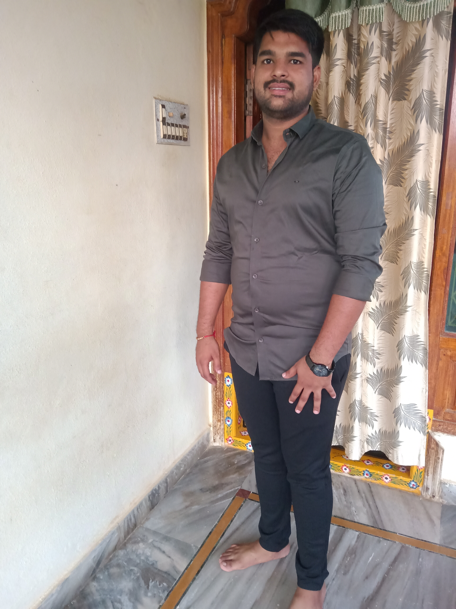

# Vamsi Krishna Kolusu
 
I have had computers as a subject from the very beginning of my education and I believed that
programming plays a key role in the advancements happening around the world. So, I chose Computer
Science as my specialization in under-graduation 
I have a keen interest in IoT(Internet of Things). It is the next industrial revolution. My ultimate goal is to
introduce a new category of devices that are used to communicate with each other with less or no human
intervention.

